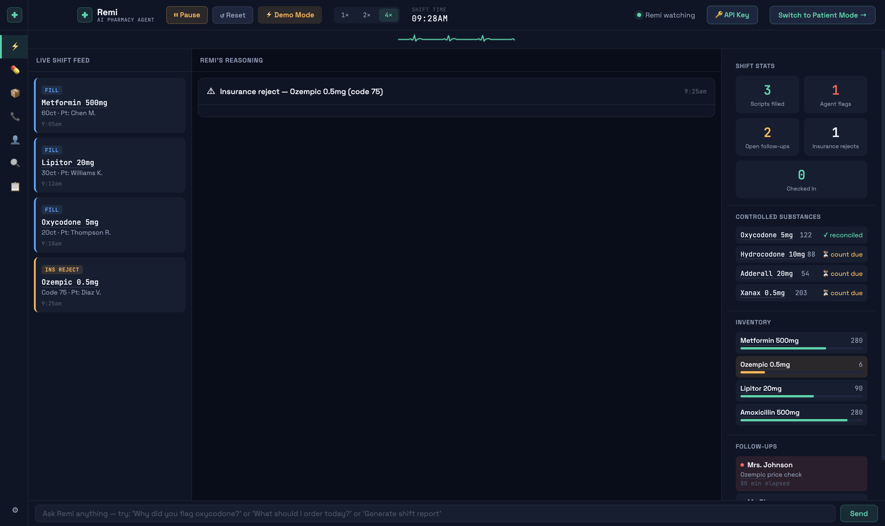
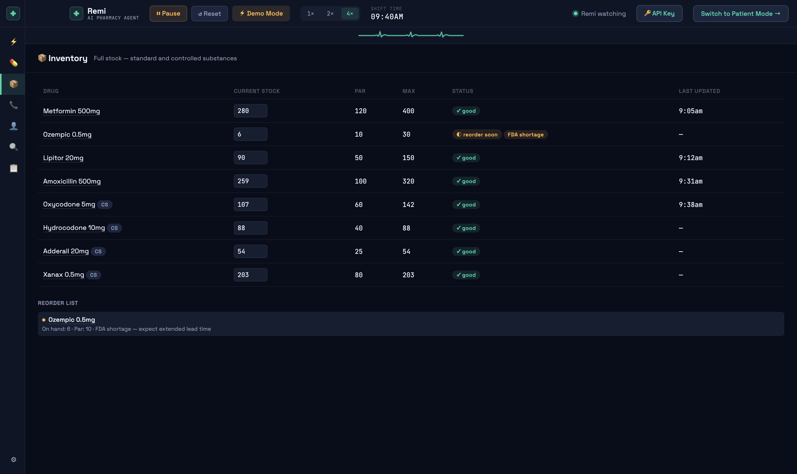
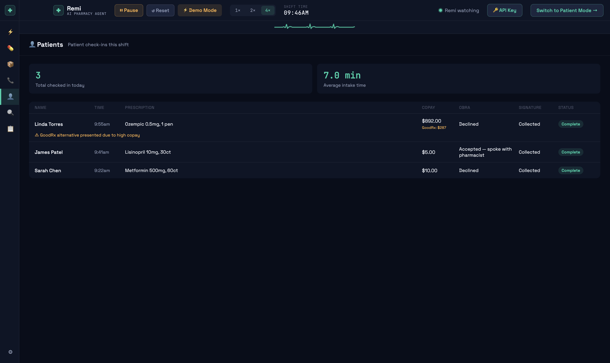
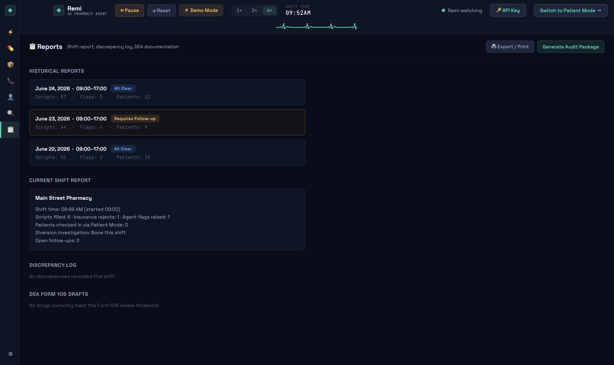
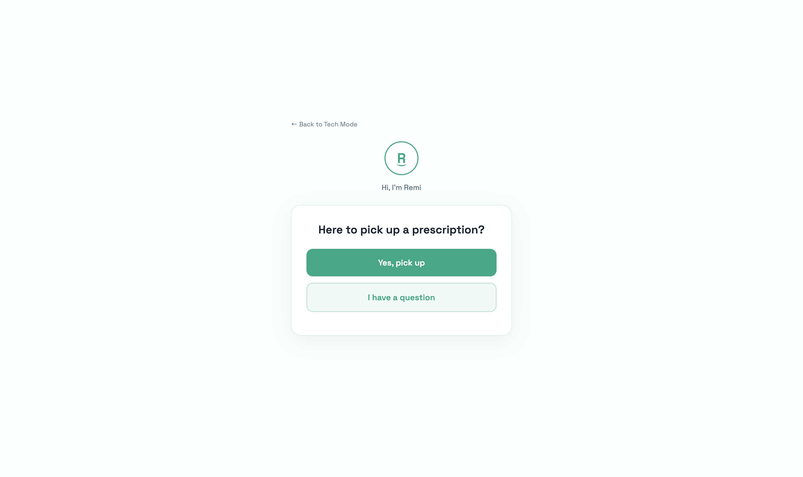
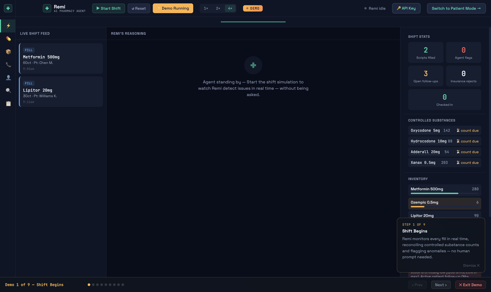

# Remi

**AI Pharmacy Agent** — an agentic desktop application for retail pharmacy technicians, built with Electron and powered by the Anthropic Claude API.

---

## Overview

Remi is a single-window desktop application that monitors a pharmacy shift in real time and operates an autonomous agent loop without being prompted. When clinical events occur — prescription fills, insurance rejections, controlled substance count discrepancies, inventory shortages — Remi selects the appropriate tool, calls the Anthropic API, reasons over the result, and updates the interface with its conclusions.

The application runs in two modes on a single shared state object. **Tech Mode** is the primary operational interface for pharmacy technicians: a three-column dashboard with a live event feed, a streaming agent reasoning panel, and a real-time state board. **Patient Mode** is a full-screen kiosk interface for patients at the pickup counter, handling identity verification, prescription lookup, copay explanation, OBRA counseling, and signature capture.

All agent reasoning visible in the interface is Claude's actual output from Anthropic API tool-use calls, streamed token by token. No reasoning strings are pre-scripted.

---

## Screenshots

**Tech Mode — Dashboard with agent reasoning**


**Inventory — stock table with FDA shortage flag**


**Patients — check-in log**


**Reports — historical shifts and DEA documentation**


**Patient Mode — pickup intake screen**


**Demo Mode — guided walkthrough**


---

## Motivation

Retail pharmacy technicians are interrupted an average of once every four minutes. Each interruption carries clinical risk: a missed count on a controlled substance, an insurance rejection left unresolved, a patient callback that ages out of memory before the end of a shift.

Controlled substance discrepancy investigations are federally mandated under DEA regulations. In the majority of independent retail pharmacies, these investigations are conducted using paper logs and manual reconciliation. Enterprise-grade solutions exist for hospital pharmacy environments. Independent retail pharmacies operate without purpose-built decision support tooling.

Remi addresses three specific failure points in the independent retail pharmacy workflow:

1. Controlled substance count discrepancies go uninvestigated until end-of-shift or audit pressure forces reconciliation — at which point the transaction window for identifying the cause has closed.
2. Insurance rejection codes are decoded manually. Technicians carry the NCPDP code list in their memory or in a physical binder. There is no standardized decision support at the counter.
3. Patient pickup interactions pull technicians out of active dispensing workflow for routine, highly structured exchanges — identity, copay, counseling offer, signature — that do not require clinical judgment and could be handled by a structured conversational interface.

---

## Tech Stack

| Layer | Technology | Notes |
|---|---|---|
| Desktop shell | Electron | Native window, application menu, dock icon, keyboard shortcuts |
| Renderer | Vanilla HTML / CSS / JS | No frontend framework. No build step. Single `index.html` file. |
| AI | Anthropic Claude (`claude-sonnet-4-6`) | Tool-use API required for genuine multi-step agentic behavior |
| Drug data | OpenFDA API | Public, no key required. Real drug label and interaction data. |
| Fonts | Space Grotesk, JetBrains Mono | Interface legibility and monospace data readability |
| Simulation engine | Custom JS state machine | Deterministic event scheduling with configurable time acceleration (1×, 2×, 4×) |
| Storage | `localStorage` | API key only. No patient data is persisted to disk. |
| Packaging | `electron-builder` | Produces `.dmg` (macOS) and `.exe` (Windows) |

---

## Getting Started

### Prerequisites

- Node.js 18 or higher
- An Anthropic API key — [console.anthropic.com](https://console.anthropic.com)

### Install and run

```bash
git clone https://github.com/anamahmedshamsi12/remi-rx.git
cd remi-rx
npm install
npm start
```

### Build a distributable

```bash
npm run build
```

Produces a packaged application in `dist/`. On macOS the output is `Remi-1.0.0-arm64.dmg`.

The build is unsigned. On macOS, first launch requires right-click → Open → Open to bypass Gatekeeper. This is expected for applications distributed without an Apple Developer ID.

### API key

On first launch, click **API Key** in the top bar and paste your Anthropic API key. The key is stored in `localStorage` under `remi_api_key` and is only transmitted to `api.anthropic.com`.

### Keyboard shortcuts

| Shortcut | Action |
|---|---|
| `Cmd/Ctrl+N` | New shift |
| `Cmd/Ctrl+P` | Toggle Patient Mode |
| `Cmd/Ctrl+R` | Generate shift report |
| `Cmd/Ctrl+,` | Settings |
| `Escape` | Return to Tech Mode |

---

## Application Modes

## Tech Mode

Tech Mode is the primary operational interface. It is a three-column layout occupying the full window, active whenever Patient Mode is not engaged. The topbar persists across modes and contains the shift clock, simulation controls (Start / Pause / Reset), speed multiplier (1×, 2×, 4×), agent status indicator, and the Patient Mode toggle.

An EKG-style waveform renders directly below the topbar — a teal animated heartbeat that pulses in response to agent activity, providing a peripheral visual indicator of system state without requiring attention.

---

### Dashboard

The Dashboard is the default view in Tech Mode. It is a three-column layout:

- **Left column (280px):** Live Shift Feed — a chronological event log updated as simulation events fire
- **Center column (flex):** Remi's Reasoning — Claude's streaming chain of thought for the most recent agent action
- **Right column (300px):** Shift Stats, Controlled Substances, Inventory, and Follow-ups — a live state board updated on every event

---

### Live Shift Feed

The Live Shift Feed is a chronological ticker of all pharmacy events fired during the current shift. Each card in the feed displays a typed badge, drug name, quantity, patient identifier, and timestamp.

Badge types and color coding:

| Badge | Color | Trigger |
|---|---|---|
| `FILL` | Blue | Prescription dispensed |
| `INS REJECT` | Amber | Insurance claim rejected |
| `SHORTAGE` | Amber | FDA shortage drug falls below par |
| `DISCREPANCY` | Red | Controlled substance count mismatch |
| `DIVERSION` | Red | Multi-cycle discrepancy pattern detected |

Example entries from a running shift:

```
FILL  — Metformin 500mg, 60ct  — Pt: Chen M.    — 9:05am
FILL  — Lipitor 20mg, 30ct     — Pt: Williams K. — 9:12am
FILL  — Oxycodone 5mg, 20ct    — Pt: Thompson R. — 9:18am  [CS]
INS   — Ozempic 0.5mg          — Code 75, Diaz V. — 9:25am
FILL  — Amoxicillin 500mg, 21ct — Pt: Martinez L.
FILL  — Oxycodone 5mg, 15ct    — Pt: Patel S.   [CS]
FILL  — Xanax 0.5mg, 30ct      — Pt: Brown C.   [CS]
```

Controlled substance fills are marked with a `[CS]` indicator. The feed is scrollable and retains the full event history for the current shift.

---

### Remi's Reasoning Panel

The Reasoning Panel occupies the center column of the Dashboard. When Remi's agent loop executes in response to an event, Claude's output is streamed into this panel one line at a time. Each line renders as it arrives from the API — no buffering, no post-processing.

The panel renders three content types:

- **Reasoning text** — prefixed with `>`, lines of Claude's internal deliberation as it evaluates the situation
- **Tool call indicators** — prefixed with `◉`, showing the exact tool name and arguments passed to it
- **Conclusion block** — a terminal summary block (rendered with a distinct background) containing Claude's recommended action for the technician

The following is a verbatim reproduction of the Reasoning Panel output for an Ozempic insurance rejection event, as it appears streamed in the interface:

```
⚠ Insurance reject — Ozempic 0.5mg (code 75)                        9:25am

> Decoding NCPDP reject 75 for Ozempic to get cause and fix.
  Simultaneously checking Ozempic inventory since stock is low
  (6/30 units) and this rejection may affect whether we even fulfill.

> Both calls are independent — running in parallel now.

◉ calling decode_reject({"code": 75, "drug": "ozm"})
◉ calling check_inventory({"drug": "ozm"})

> Reject is 'Refill too soon' — patient is hitting their fill window
  early. Stock is critically low (6/30, 20% of max) with an active
  FDA shortage. Logging a follow-up for Diaz V. so this doesn't
  fall through the cracks.

◉ calling add_followup({
    patientName: "Diaz V.",
    reason: "Ozempic 0.5mg rejected code 75 (refill too soon) —
    needs vacation override or PA initiated; advise GoodRx cash
    price as interim option"
  })

╔══════════════════════════════════════════════════════════════════╗
  Reject 75 = Refill Too Soon — Diaz V. is trying to fill Ozempic
  before their fill window opens. Here's what to do right now:

  1. Tell the patient their insurance won't cover it yet, and offer
     the GoodRx cash price as an immediate option while this gets
     resolved.
  2. Call the PBM to request a vacation override if the patient has
     a travel need, or start a prior authorization if there's a
     clinical reason (e.g. dose change, lost medication).
  3. Heads up on stock: Ozempic is at 6 pens on hand with an active
     FDA shortage — even if the override goes through, flag the
     pharmacist before promising stock to Diaz V., because you're
     critically low and have an overdue price-check follow-up for
     Mrs. Johnson on the same drug.
╚══════════════════════════════════════════════════════════════════╝
```

This output is Claude's actual API response. The tool calls (`decode_reject`, `check_inventory`, `add_followup`) are genuine Anthropic API tool-use invocations with structured JSON arguments. The reasoning lines are Claude's streamed `text` deltas between and after tool calls. Nothing in this panel is a pre-scripted string.

Drug names that appear in reasoning text are wrapped in interactive spans. Hovering any drug name surfaces a tooltip populated from the OpenFDA API (see [Drug Information Tooltips](#drug-information-tooltips)).

---

### Shift Stats

The Shift Stats panel occupies the upper section of the right column. It displays five live counters updated on every event:

| Counter | Color | Description |
|---|---|---|
| Scripts Filled | Teal | Total prescription fills completed this shift |
| Agent Flags | Red | Events that triggered a pharmacist escalation |
| Open Follow-ups | Amber | Unresolved items in the follow-up queue |
| Insurance Rejects | White | Rejection events processed this shift |
| Checked In | White | Patient Mode intake sessions completed |

All counters animate on increment using a flash transition to draw peripheral attention without interrupting active workflow.

---

### Controlled Substances Log

Below Shift Stats, the Controlled Substances section displays real-time count reconciliation for each scheduled drug dispensed this shift.

Each row shows the drug name, current on-hand count, and reconciliation status:

| Status | Indicator | Meaning |
|---|---|---|
| Reconciled | `✓ reconciled` (teal) | Expected count matches actual count |
| Count due | `⏳ count due` (amber) | Physical count has not been performed |
| Discrepancy | `⚠ gap` (red) | Expected and actual counts diverge |

Example state mid-shift:

```
Oxycodone 5mg    107   ✓ reconciled
Hydrocodone 10mg  88   ⏳ count due
Adderall 20mg     54   ⏳ count due
Xanax 0.5mg      173   ✓ reconciled
```

When a discrepancy is detected, Remi automatically initiates a `trace_discrepancy` tool call. See [Agent Decision Loop](#agent-decision-loop) for the full investigation sequence.

---

### Inventory Panel

The Inventory panel in the right column displays current stock levels for all tracked drugs as inline progress bars. Each bar is colored relative to the drug's maximum stock level:

- **Green** — stock above par
- **Amber** — approaching reorder point
- **Red** — below par or critically low

Example state during a shortage event:

```
Metformin 500mg  ████████████████████  280  (high)
Ozempic 0.5mg    █░░░░░░░░░░░░░░░░░░░    6  (critical — FDA shortage)
Lipitor 20mg     ████████░░░░░░░░░░░░   90
Amoxicillin 500mg████████████████████  259
```

When an FDA-designated shortage drug falls below par, the inventory bar turns red and Remi adds a reorder alert with an extended lead-time advisory.

---

### Follow-up Queue

The Follow-up Queue appears at the bottom of the right column and in full detail in the Follow-ups navigation view. The queue persists for the full shift and items age in real time.

Remi's agent loop adds items to the queue autonomously when events warrant — for example, adding a follow-up for Diaz V. after the Ozempic rejection example above. Technicians can also add items manually through the Follow-ups view.

Items are displayed with elapsed time since creation. Items past a configurable threshold render with a red background to indicate they are overdue.

---

## Patient Mode

Patient Mode is a full-screen interface that replaces the Tech Mode layout when the technician clicks **Switch to Patient Mode**. The screen is designed for direct patient interaction at a shared counter terminal: large touch targets, generous spacing, high contrast, and a light background (`#FAFBFF`).

Tech Mode state continues to update in the background while Patient Mode is active. If a patient presents to pick up a drug carrying an active discrepancy or shortage flag in the current shift, Remi surfaces a silent alert to the technician without displaying it to the patient.

Patient Mode is navigated from the topbar in Tech Mode. The `← Back to Tech Mode` link at the top left returns the technician to the dashboard. `Cmd/Ctrl+P` also toggles between modes.

---

### Welcome Screen

The Welcome Screen is the entry point to Patient Mode. It displays:

- The Remi avatar (a circular icon containing "R" in teal) with "Hi, I'm Remi" greeting
- A card containing the prompt **"Here to pick up a prescription?"**
- Two full-width buttons: **Yes, pick up** (primary, teal) and **I have a question** (secondary, outlined)

Selecting "Yes, pick up" advances to the Identity Verification step. Selecting "I have a question" opens a free-text input for the patient to describe their question, which is then surfaced to the technician.

---

### Identity Verification

The Identity Verification step collects the minimum required information to surface a prescription without prompting the technician to locate it manually.

Fields:

- Last name (text input)
- Date of birth (MM/DD/YYYY format)

Both fields are required. Incomplete submission highlights the empty field with an amber border. On successful submission, Remi matches the identity against active prescriptions in shift state and advances to the Prescription Lookup step.

---

### Prescription Lookup

The Prescription Lookup step displays the matched prescription ready for pickup:

- Drug name (formatted)
- Prescriber name
- Quantity
- A **"Ready for pickup"** status pill

The patient confirms the prescription is correct by clicking **Continue →**, which advances to the Copay Explanation step.

---

### Copay Explanation

The Copay Explanation step presents the patient's financial responsibility for the prescription:

- Copay amount (patient share)
- Insurance contribution
- Total retail cost

When the copay exceeds a configured threshold, Remi automatically calculates and surfaces a GoodRx cash-pay comparison:

```
💡 Good news — GoodRx cash price is $267.00, which is lower.
   Show this to your pharmacist.
```

The patient selects **That works for me** to proceed, or **I have a question about my cost** to open a text input that routes their question to the technician queue.

---

### OBRA Counseling Offer

The OBRA '90 Counseling Offer step satisfies the federally mandated requirement to offer pharmacist counseling at the point of dispensing for Medicaid patients and as standard practice in many states.

The interface presents the offer as a plain-language question. The patient selects one of two responses:

- **Yes please** — Remi queues a pharmacist counseling request with the patient name, drug, and any optional question the patient provides. The follow-up is added to the technician's queue with full context.
- **No thanks, I'm good** — Remi logs the offer and the declination to the shift record and the patient's intake transcript.

Both responses are documented automatically with timestamp and drug name. No manual logging is required.

---

### Signature Capture

Following counseling, the patient acknowledges receipt of their prescription. The completed check-in record is written to:

- The **Patients** view (accessible in Tech Mode under the Patients tab)
- The current shift's intake transcript
- The Shift Stats counter ("Checked In")

A real-time notification surfaces in Tech Mode when a patient completes intake in Patient Mode, so the technician is aware without needing to monitor the Patient Mode screen.

---

## Navigation

The left sidebar provides access to seven views. The active view is highlighted in teal. The sidebar is collapsible.

---

### Dashboard

The default view. Displays the three-column layout described above: Live Shift Feed, Remi's Reasoning panel, and the Shift Stats / CS / Inventory / Follow-ups state board.

---

### Dispensing

The Dispensing view is the controlled substance log for the current shift. It displays a filterable table with the following columns:

| Column | Description |
|---|---|
| Time | Fill timestamp (shift time) |
| Drug | Drug name |
| Qty | Quantity dispensed |
| Patient | Patient identifier |
| Tech | Dispensing technician |
| Expected | Expected on-hand count post-fill |
| Actual | Actual count (from physical reconciliation) |
| Delta | Difference between expected and actual |

The table supports filtering by drug name and by status (all, reconciled, discrepancy, count due). Records with non-zero delta values are highlighted in red. The view updates in real time as fills are processed.

A **Export CSV** button in the view header generates a downloadable spreadsheet of all dispensing records for the shift.

---

### Inventory

The Inventory view displays full stock status for all tracked drugs — both standard and controlled substances — in a single table.

Columns:

| Column | Description |
|---|---|
| Drug | Drug name, with `CS` badge for controlled substances |
| Current Stock | Editable input field for manual count adjustment |
| PAR | Minimum stock threshold before reorder is indicated |
| MAX | Maximum stocking level |
| Status | `good`, `reorder soon`, or inline shortage flag |
| Last Updated | Timestamp of most recent count update |

Controlled substance rows display a small teal `CS` badge next to the drug name.

The **Status** column renders compound badges when applicable. An FDA-shortage drug approaching reorder shows both an amber `reorder soon` badge and a teal `FDA shortage` badge simultaneously:

```
Ozempic 0.5mg  |  6  |  10  |  30  |  ⏱ reorder soon  🏷 FDA shortage  |  —
```

The **Reorder List** section below the table aggregates all drugs currently below PAR with a plain-language advisory:

```
REORDER LIST
• Ozempic 0.5mg
  On hand: 6 · Par: 10 · FDA shortage — expect extended lead time
```

---

### Follow-ups

The Follow-ups view is the full patient callback and escalation queue for the shift. Items added by the agent loop and items added manually by the technician appear in the same list.

Each item displays:

- Patient name
- Elapsed time since the item was created
- Reason / action required
- Status badge (`open`, `deferred`, `complete`)

Items are color-coded by age. Items past the overdue threshold render with a red background.

Action buttons on each card:

| Button | Action |
|---|---|
| `✓ Complete` | Marks the item resolved and removes it from the active queue |
| `⏭ Defer 30m` | Resets the elapsed timer by 30 minutes |
| `⚠ Escalate` | Flags the item for pharmacist review |

A **filter dropdown** at the top of the view allows filtering by status (all, open, deferred, overdue). A manual entry form above the list accepts a patient name and reason to add items directly.

---

### Patients

The Patients view displays a log of all patient check-ins completed through Patient Mode during the current shift.

Summary metrics at the top of the view:

- Total checked in today
- Average intake time (minutes)

Each row in the check-in log displays:

| Column | Description |
|---|---|
| Name | Patient last name |
| Time | Check-in timestamp |
| Prescription | Drug name and quantity |
| Copay | Patient copay amount |
| OBRA | Counseling outcome (Declined / Accepted — spoke with pharmacist) |
| Signature | Collection status |
| Status | `Complete` or `In Progress` |

When a GoodRx alternative was presented due to a high copay, an amber advisory note appears below the row:

```
⚠ GoodRx alternative presented due to high copay
```

---

### Interactions

The Interactions view provides a drug interaction checker backed by the OpenFDA API and Claude reasoning. The technician enters any two drug names and receives:

- **Severity classification** — Contraindicated, Major, Moderate, or Minor
- **Mechanism** — The pharmacological basis of the interaction
- **Clinical management** — Recommended action for the technician or pharmacist

Results are disclosed in the interface as clinical decision support only, not as a replacement for a certified clinical interaction database such as Lexicomp or Micromedex.

#### Drug Information Tooltips

Throughout the application — in the Reasoning Panel, event feed, and dispensing log — drug names are rendered as interactive spans. Hovering any drug name for 300ms surfaces a tooltip containing:

- Drug class
- DEA schedule (if applicable)
- Standard dosing range
- Black box warnings (if present)
- Known interactions

Tooltip data is fetched from the OpenFDA drug label API. Results are cached per session to avoid redundant network requests.

---

### Reports

The Reports view consolidates documentation for the current shift and provides access to historical shift records.

#### Historical Reports

The top section displays a collapsible list of prior shift records. Each entry shows the shift date range, total scripts filled, flag count, and patient count. Clicking an entry expands the full report text for that shift.

#### Current Shift Report

A plain-text shift summary generated from current state, including:

- Shift start time and pharmacy name
- Total scripts filled
- Insurance rejects processed
- Patients checked in via Patient Mode
- Diversion investigations initiated
- Open follow-ups at time of generation

#### Discrepancy Log

All controlled substance discrepancy events from the current shift, formatted for pharmacist review.

#### DEA Form 106 Drafts

When a diversion pattern is detected — defined as unexplained count gaps on the same drug across multiple reconciliation cycles within a single shift — Remi generates DEA Form 106 documentation language automatically. The draft includes drug name, quantity gap, timeline, and chain of evidence from the dispensing log. This draft requires pharmacist review and is not submitted automatically.

#### Shift Handoff Report

Clicking **Generate Audit Package** triggers a Claude API call that synthesizes the full shift record into a structured handoff report. The report includes open follow-ups, unresolved discrepancies, recommended actions for the incoming technician, and any DEA documentation initiated. The report is rendered in the UI and can be printed via the browser print dialog.

---

## Demo Mode

Demo Mode is a curated, self-running walkthrough of all major features, accessible via the **⚡ Demo Mode** button in the topbar. It is intended for first-time users or for demonstrations to observers unfamiliar with the application.

When Demo Mode is active:

- The shift clock is replaced by an amber **DEMO** badge
- A progress bar appears at the bottom of the window showing current step, step title, and nine progress dots
- A floating overlay card appears in the lower right corner with a description of what is being demonstrated
- The simulation is driven autonomously: fills fire, rejections fire, patient intake runs end-to-end, and the command bar types and submits a query automatically

The nine demo steps in sequence:

| Step | Title | What fires |
|---|---|---|
| 1 | Shift Begins | Two prescription fills; state board updates |
| 2 | Insurance Rejection | Ozempic reject — parallel tool calls, reasoning panel streams |
| 3 | CS Fills | Two oxycodone fills; Dispensing view navigated |
| 4 | First Discrepancy | Oxycodone count gap; `trace_discrepancy` initiated |
| 5 | Inventory Alert | Ozempic shortage; Inventory view navigated |
| 6 | Patient Pickup | Full automated Patient Mode intake for "Chen" |
| 7 | Diversion Detected | Second oxycodone gap; `generate_form106` triggered |
| 8 | Ask Remi | Command bar auto-types and submits a handoff report query |
| 9 | Shift Complete | Reports view navigated; full shift audit trail shown |

The **Next ›** button skips the current step's remaining delay. The **Prev** button restarts Demo Mode from the beginning (reverting state). **✕ Exit Demo** clears all demo state and resets the shift.

---

## Agentic Architecture

### Agent Decision Loop

When a simulation event fires, Remi executes a multi-turn agent loop:

```
Event fires (fill / reject / shortage / discrepancy / diversion)
  │
  ├─ Build state snapshot
  │    Current inventory, CS counts, open follow-ups,
  │    shift log, patient checkins
  │
  ├─ Call Claude API
  │    messages: [system prompt + state snapshot + event description]
  │    tools: [decode_reject, check_inventory, trace_discrepancy,
  │            flag_pharmacist, generate_form106, add_followup,
  │            generate_shift_report]
  │
  ├─ Claude selects tool(s) and returns tool_use block(s)
  │    Tool calls may be parallel (multiple in one response)
  │
  ├─ Execute tool(s)
  │    Each tool reads from and may write to PHARMACY_STATE
  │
  ├─ Return tool result(s) to Claude
  │    New API call: messages append tool_result blocks
  │
  ├─ Claude reasons over results and returns final response
  │    Streamed token by token into the Reasoning Panel
  │
  └─ Update state and UI
       renderStateBoard(), renderInventoryView(), etc.
       Flash animated stat counters
```

The loop repeats for each tool result turn until Claude returns a response without a tool call. The number of turns is not capped — Claude determines when investigation is complete.

---

### Tool Definitions

Seven tools are registered with the Claude API. All are defined as Anthropic tool-use schemas with `name`, `description`, and `input_schema`.

| Tool | Trigger | Action |
|---|---|---|
| `decode_reject` | Insurance rejection event | Returns plain-English meaning of NCPDP rejection code, cause, resolution path, and patient-facing script |
| `check_inventory` | Shortage event or rejection involving a low-stock drug | Returns current stock, PAR level, FDA shortage status, and reorder advisory |
| `trace_discrepancy` | Controlled substance count mismatch | Reconstructs expected count from transaction history, identifies gap, assesses diversion vs. logging error |
| `flag_pharmacist` | Escalation required | Creates a pharmacist alert with clinical context and recommended action |
| `generate_form106` | Diversion pattern confirmed | Generates DEA Form 106 draft language from the dispensing log |
| `add_followup` | Patient action required post-event | Adds a structured follow-up item to the queue with patient name, reason, and priority |
| `generate_shift_report` | End-of-shift or on-demand query | Synthesizes full shift record into a structured handoff report |

Tool calls visible in the Reasoning Panel — for example, `◉ calling decode_reject({"code": 75, "drug": "ozm"})` — are rendered directly from the `tool_use` content blocks returned in Claude's API response. The arguments shown are the exact JSON passed to the tool.

---

### Claude API Integration

The agent loop uses the Anthropic Messages API with streaming enabled. Two separate API contexts are maintained:

**Agentic loop** (`runAgentTurn`) — Used for autonomous event-driven reasoning. Receives a system prompt containing full shift state as structured context, a tool list, and the triggering event description. Streamed responses render into the Reasoning Panel.

**Command bar** (`askRemi`) — Used for free-form technician queries. Single-turn, non-streaming call. Receives shift state in the system prompt and the technician's query as the user message.

The API key is read from `localStorage` at call time and transmitted only in the `x-api-key` header to `api.anthropic.com`. No key is bundled in the application.

---

## Project Structure

```
remi-rx/
├── main.js                 # Electron main process — window, menu, IPC
├── preload.js              # Context bridge — exposes remiAPI to renderer
├── index.html              # Full application renderer (single file)
├── package.json
├── assets/
│   └── icon.png            # Application icon (1024×1024 PNG)
├── screenshots/            # Application screenshots
├── tests/
│   ├── remi.test.js        # Full test suite — 87 tests, no external framework
│   └── core.js             # Pure logic exports for testing
└── docs/
    ├── ARCHITECTURE.md     # Detailed system design document
    ├── DOMAIN.md           # Pharmacy domain reference
    └── DEMO.md             # Demo walkthrough guide
```

---

## Running Tests

```bash
node tests/remi.test.js
```

No external test framework is required. The test file runs under Node.js with browser globals mocked at the top of the file.

The suite covers 87 assertions across 14 sections:

- Shift time formatting
- Event handler outputs (fill, reject, shortage, discrepancy, diversion)
- All seven tool functions
- State snapshot structure
- Patient intake flow
- Edge cases (zero stock, maximum stock, parallel tool calls, confidence thresholds)

Tests that require edge-case state (e.g., drug stock at zero) save and restore `PHARMACY_STATE` before and after each assertion to prevent cross-test contamination.

---

## Design Decisions

**Electron over browser deployment**
A desktop application is the correct form factor for pharmacy counter software. Pharmacies install software — they do not navigate to URLs. Electron provides a native window, application menu, dock presence, and keyboard shortcuts that match the expectations of installed clinical tooling.

**Single renderer file**
The entire frontend lives in `index.html`. This keeps the deployment surface minimal and makes the codebase readable in a single pass. The AI reasoning layer is the architectural complexity — the delivery mechanism should be invisible.

**Genuine tool-use over scripted responses**
The Reasoning Panel renders Claude's actual output from each tool-use API call. Scripted responses would be faster to implement and visually indistinguishable to an observer. The distinction matters for correctness: a scripted system cannot handle events outside its script. A genuine agentic loop can reason about novel combinations of events, stock states, and patient history.

**Shared state object across modes**
Tech Mode and Patient Mode read and write to a single `PHARMACY_STATE` object. This enables cross-mode awareness — Patient Mode can surface a discrepancy flag on a drug being picked up without any synchronization layer, because both modes are operating on the same in-memory object.

**Pre-scripted simulation over live PMS integration**
Remi does not integrate with a live pharmacy management system. The simulation engine fires deterministic events representing realistic shift scenarios. This allows the agentic reasoning layer to be evaluated independently of data integration complexity, and allows the application to run without a network connection to any pharmacy system.

**OpenFDA for drug data**
The OpenFDA drug label API is free, public, requires no API key, and is maintained by the United States federal government. A production implementation would replace this with a certified clinical database — Lexicomp, Micromedex, or equivalent — disclosed to users as such. The application already includes this disclosure in the Interactions view.

**Parallel tool calls**
Where two tool calls are independent — for example, `decode_reject` and `check_inventory` during a rejection event on a low-stock drug — Remi passes both tool definitions simultaneously and allows Claude to return them in a single response. This reduces latency and produces more coherent multi-factor reasoning. The Reasoning Panel explicitly narrates when Claude is running calls in parallel: `> Both calls are independent — running in parallel now.`

---

## Roadmap

**V2 — Data integration**
- PioneerRx and Datascan PMS integration via vendor API
- Real transaction history replacing simulated fill events
- Live inventory sync from Cardinal Health and McKesson wholesaler feeds

**V2 — Communication layer**
- Outbound fax to prescriber offices via SRFax API
- Patient SMS notifications via Twilio
- Prescriber callback queue with automated follow-up scheduling

**V3 — Hardware**
- Dedicated counter device: Raspberry Pi 4, 8-inch touchscreen, integrated microphone and speaker
- Wake-word activation for hands-free technician queries
- Patient-facing display with proximity detection for automatic mode switching
- Local processing for PHI to reduce dependency on external network

---

## Author

**Anam Shamsi**

